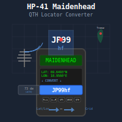

# hp-41_maidenhead

 

HP-41 program for converting between latitude/longitude coordinates and Maidenhead grid squares (QTH locators) used in amateur radio.

The Maidenhead Locator System is a geocode system used by amateur radio operators to succinctly describe their geographic coordinates. A typical grid square like "JP34kl" represents a specific location - in this case, a grid in northern Norway.

## Program

### MAIDENHEAD.41
Bidirectional converter between latitude/longitude and Maidenhead grid squares with USER menu interface.

**Usage:**
1. Execute `XEQ "MAIDEN"`
2. The program activates USER mode (SF 27) and displays menu:
   - **A** key: Grid to Lat/Long conversion
   - **B** key: Lat/Long to Grid conversion
3. After each conversion, R/S returns you to the menu

**For Grid to Lat/Long (A key):**
- Enter the 6-character grid square when prompted (e.g., "JP99ap")
- The program displays the latitude and longitude of the grid center
- R/S: Returns to menu

**For Lat/Long to Grid (B key):**
- Enter latitude when prompted (e.g., 69.65 for Tromsø, Norway)
- Enter longitude when prompted (e.g., 18.96)
- The program displays the grid square (e.g., "JP99ap")
- R/S: Returns to menu

**Examples:**
- Grid to Lat/Long: "IO91wl" → LAT: 51.479, LON: -0.125
- Lat/Long to Grid: 51.48, -0.13 (London) → "IO91wl"

## Technical Details

The Maidenhead system divides the Earth into:
- **Fields**: 18×18 zones labeled with letters A-R (20° longitude × 10° latitude)
- **Squares**: Each field divided into 10×10 squares labeled 0-9 (2° × 1°)
- **Subsquares**: Each square divided into 24×24 subsquares labeled a-x (5' × 2.5')

The 6-character format alternates between longitude and latitude: 
- Characters 1,3,5: Longitude (Field letter, Square digit, Subsquare letter)
- Characters 2,4,6: Latitude (Field letter, Square digit, Subsquare letter)

## Requirements
- HP-41C/CV/CX calculator or compatible
- Alpha capability for entering/displaying grid squares
- Uses registers 01-13 for calculations

## License

This is free and unencumbered software released into the public domain.

Anyone is free to copy, modify, publish, use, compile, sell, or
distribute this software, either in source code form or as a compiled
binary, for any purpose, commercial or non-commercial, and by any
means.

In jurisdictions that recognize copyright laws, the author or authors
of this software dedicate any and all copyright interest in the
software to the public domain. We make this dedication for the benefit
of the public at large and to the detriment of our heirs and
successors. We intend this dedication to be an overt act of
relinquishment in perpetuity of all present and future rights to this
software under copyright law.

THE SOFTWARE IS PROVIDED "AS IS", WITHOUT WARRANTY OF ANY KIND,
EXPRESS OR IMPLIED, INCLUDING BUT NOT LIMITED TO THE WARRANTIES OF
MERCHANTABILITY, FITNESS FOR A PARTICULAR PURPOSE AND NONINFRINGEMENT.
IN NO EVENT SHALL THE AUTHORS BE LIABLE FOR ANY CLAIM, DAMAGES OR
OTHER LIABILITY, WHETHER IN AN ACTION OF CONTRACT, TORT OR OTHERWISE,
ARISING FROM, OUT OF OR IN CONNECTION WITH THE SOFTWARE OR THE USE OR
OTHER DEALINGS IN THE SOFTWARE.

For more information, please refer to <http://unlicense.org/>
